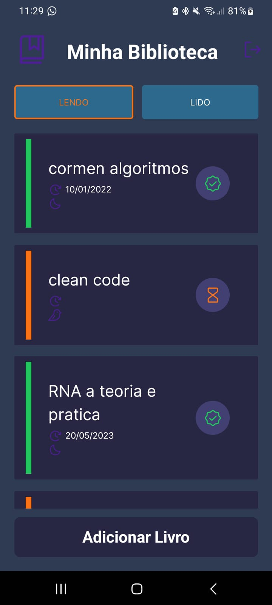

# Livraria
## Projeto usando Typescript, React Native, Expo, Styled Components e integração com firebase

### Este projeto foi desenvolvido com o objetivo de aprender e praticar os conceitos aprendidos no curso de programação de dispositivos móveis do +IFMG. O qual foi postado o certificado em meu perfil do [Linkedin!](https://www.linkedin.com/in/higor-pereira-comp/)

Sinta-se a vontade para baixar e testar o projeto em sua máquina. Basta colocar sua chave de autenticação do firebase no arquivo firebase.tsx.

Segue uma imagem do projeto rodando no meu celular:

Feito por Higor Pereira 👋🏽 [Entre em contato!](https://www.linkedin.com/in/higor-pereira-comp/)
